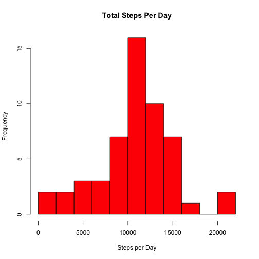
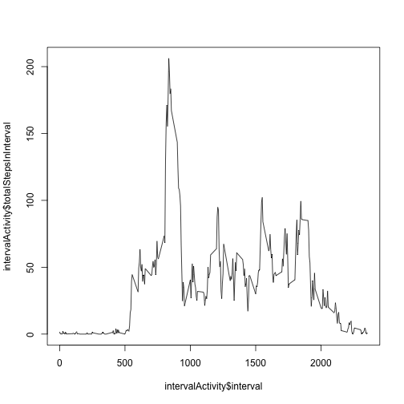
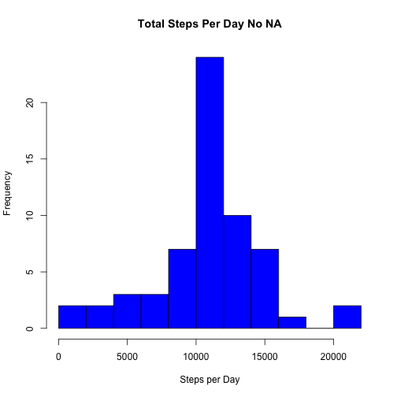
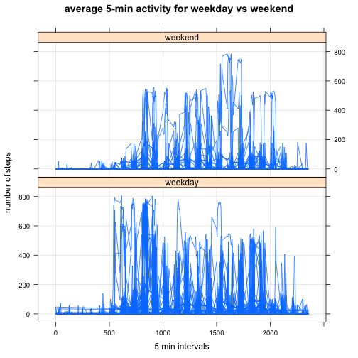
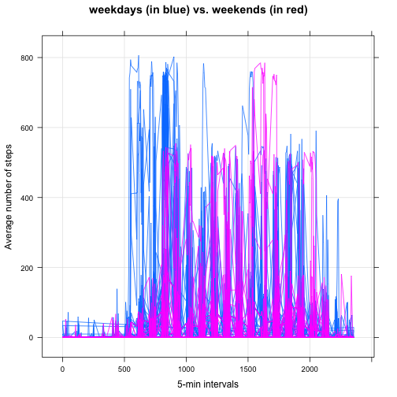

Reproducible Research--Assignment 1
=====================================

In this assignment we make use of data from a personal activity monitoring device. This device collects data at 5 minute intervals through out the day. The data consists of two months of data from an anonymous individual collected during the months of October and November, 2012 and include the number of steps taken in 5 minute intervals each day.

# here we read the dataset and load data in R

```r
library(datasets)
library(lattice)
activity <- read.csv("activity.csv", head = TRUE)
```

We find the data set structure and count the number of NA values.

```r
str(activity)
```

```
## 'data.frame':	17568 obs. of  3 variables:
##  $ steps   : int  NA NA NA NA NA NA NA NA NA NA ...
##  $ date    : Factor w/ 61 levels "2012-10-01","2012-10-02",..: 1 1 1 1 1 1 1 1 1 1 ...
##  $ interval: int  0 5 10 15 20 25 30 35 40 45 ...
```

```r
sum(activity$steps, activity$date=="2012-11-03", na.rm=T)
```

```
## [1] 570896
```

Next we change the format of dates in our data frame.

```r
activity$date <- as.Date(activity$date)
```

next we calculate the total number of steps taken per day and we average the number of steps for each interval:

```r
dailyActivity <- aggregate(steps ~ date, data=activity, FUN = "sum", na.rm=TRUE)
intervalActivity <- aggregate(steps ~ date, data=activity, FUN = "mean", na.rm=TRUE)
```

Here we make a histogram of the total number of steps taken each day:

```r
hist(dailyActivity$steps, main= "Total Steps Per Day", breaks=10, xlab="Steps per Day", col="red")
```

 

The summary, mean and median of the total number of steps taken per day are as follows:

```r
summary(dailyActivity$steps)
```

```
##    Min. 1st Qu.  Median    Mean 3rd Qu.    Max. 
##      41    8841   10760   10770   13290   21190
```

```r
mean(dailyActivity$steps)
```

```
## [1] 10766.19
```

```r
median(dailyActivity$steps)
```

```
## [1] 10765
```

We make a time series plot (i.e. type = "l") of the 5-minute interval (x-axis) and the average number of steps taken, averaged across all days (y-axis):


```r
intervalActivity <- aggregate(activity[, "steps"], by = list(as.numeric(activity$interval )), FUN = "mean", na.rm=TRUE)
names(intervalActivity) <- c("interval", "totalStepsInInterval")
plot(intervalActivity$interval,intervalActivity$totalStepsInInterval, type="l")
```

 

We find which 5-minute interval, on average across all the days in the dataset, contains the maximum number of steps.

```r
intvMax <- intervalActivity[which.max(intervalActivity$totalStepsInInterval), ]
intvMax
```

```
##     interval totalStepsInInterval
## 104      835             206.1698
```

The total number of missing values in the dataset is as follows:

```r
sum(is.na(activity$steps))
```

```
## [1] 2304
```

We fill in all of the missing values in the dataset by using the mean for that 5-minute interval,


```r
activityNoNA <- activity
for(i in 1:nrow(activityNoNA)){
    if (is.na(activityNoNA$steps[i])) {
        z <- intervalActivity$totalStepsInInterval[intervalActivity$interval == activityNoNA$interval[i]];
        activityNoNA$steps[i] <- z;
    }
}
```

and we create a new data set that is equal to the original dataset but with the missing data filled in.


```r
dailyNoNA <- aggregate(activityNoNA[, "steps"], by = list(activityNoNA$date ), FUN = "sum", na.rm=TRUE)
names(dailyNoNA) <- c("date", "totalStepsPerDay")
```

We make a histogram of the total number of steps taken each day and Calculate and report the mean and median total number of steps taken per day for this new data set:


```r
hist(dailyNoNA$totalStepsPerDay, breaks=10, main= "Total Steps Per Day No NA", xlab="Steps per Day", col="blue")
```

 

Its mean and median are as follows:

```r
mean(dailyNoNA$totalStepsPerDay)
```

```
## [1] 10766.19
```

```r
median(dailyNoNA$totalStepsPerDay)
```

```
## [1] 10766.19
```

As we see from these results, replacing the missing values did not change the histogram and the mean and median are not much changed. THe total number of steps per day has increased when we changed the missing values.

For the last part, we use the function weekdays() and create a new factor variable in the filled in dataset with two levels – “weekday” and “weekend” indicating whether a given date is a weekday or weekend day.


```r
activityNoNA$weekday <- weekdays(as.Date(activityNoNA$date))
activityNoNA$daytype <- factor(activityNoNA$weekday =="Saturday" | activityNoNA$weekday =="Sunday")
levels(activityNoNA$daytype)[levels(activityNoNA$daytype)=="TRUE"] <-  "weekend"    
levels(activityNoNA$daytype)[levels(activityNoNA$daytype)=="FALSE"] <-  "weekday"  
```

Finally we make a panel plot containing a time series plot (i.e. type = "l") of the 5-minute interval (x-axis) and the average number of steps taken, averaged across all weekday days or weekend days (y-axis).:


```r
library(lattice)
head(activityNoNA)
```

```
##       steps       date interval weekday daytype
## 1 1.7169811 2012-10-01        0  Monday weekday
## 2 0.3396226 2012-10-01        5  Monday weekday
## 3 0.1320755 2012-10-01       10  Monday weekday
## 4 0.1509434 2012-10-01       15  Monday weekday
## 5 0.0754717 2012-10-01       20  Monday weekday
## 6 2.0943396 2012-10-01       25  Monday weekday
```

```r
intervalFNA <- aggregate(steps ~ interval + daytype, data=activityNoNA, FUN="mean")

xyplot(steps ~ interval | daytype, data= activityNoNA, type="l", grid=T, layout=c(1, 2), ylab="number of steps", xlab="5 min intervals", main="average 5-min activity for weekday vs weekend")
```

 

Here we look at both graphs in one panel for comparison:

```r
xyplot(steps ~ interval, data=activityNoNA, groups=activityNoNA$daytype, type="l", grid=T, ylab="Average number of steps", xlab="5-min intervals", main="weekdays (in blue) vs. weekends (in red)")
```

 

 


